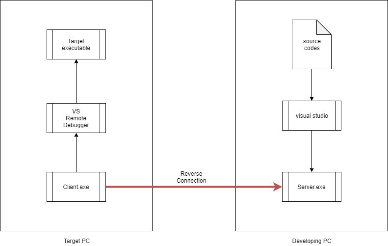
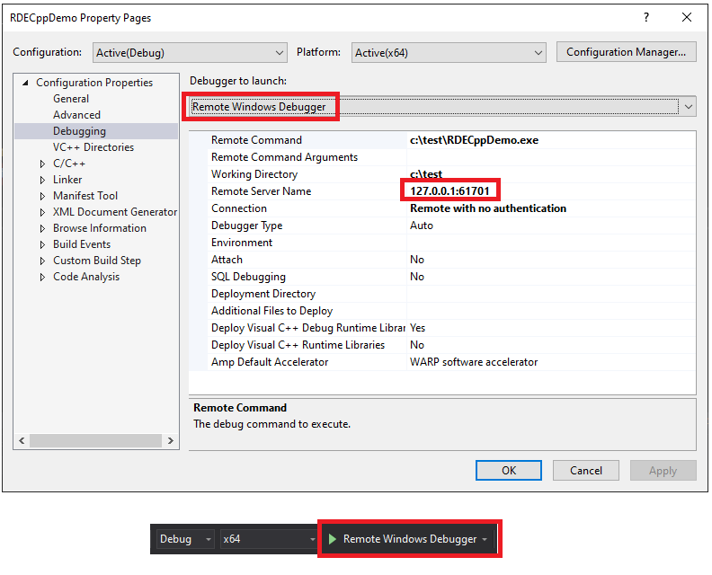

# RemoteDebuggerMate provide tools for Visual Studio Remote Debugger

## what is features provided?

reverse connect from target computer to developing computer for visual studio remote debugger.

I create this tool for I want to remote debugging on the executable on many VMs from my developing PC. the VMs are using different OS and I want to make it easy to fix bugs.

## Steps
* (1) Configure the Visual Studio in Developing PC;

* (2) Startup Server.exe in Developing PC;
DOS> Server.exe 61702 61701
* (3) Startup Visual Studio Remote Debugger in Target PC and set it's right permission;
* (4) Startup Client.exe in Target PC;
DOS> Client.exe 192.168.0.14 61702 4204
* (5) Start debugging on Visual Studio in Developing PC;

## Versions

	Version 0.1
	
## Change Logs

### 03 Feb 2021
* Create repository.